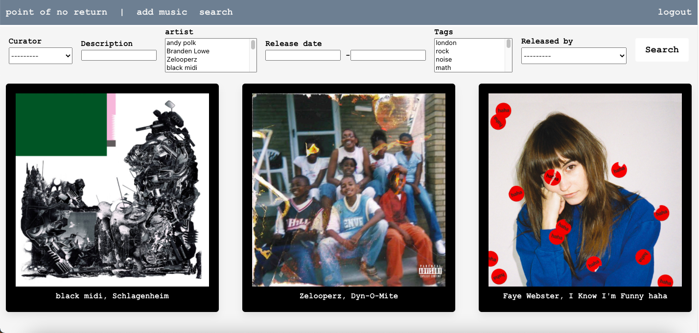
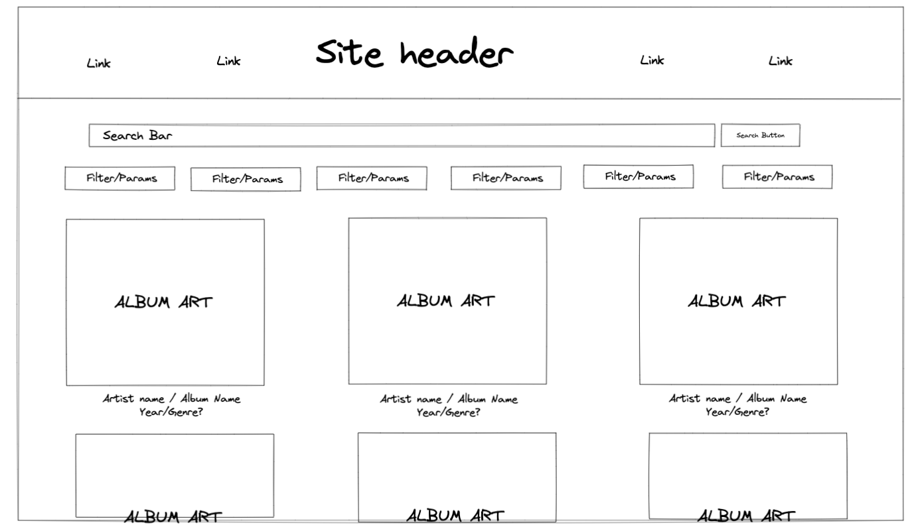
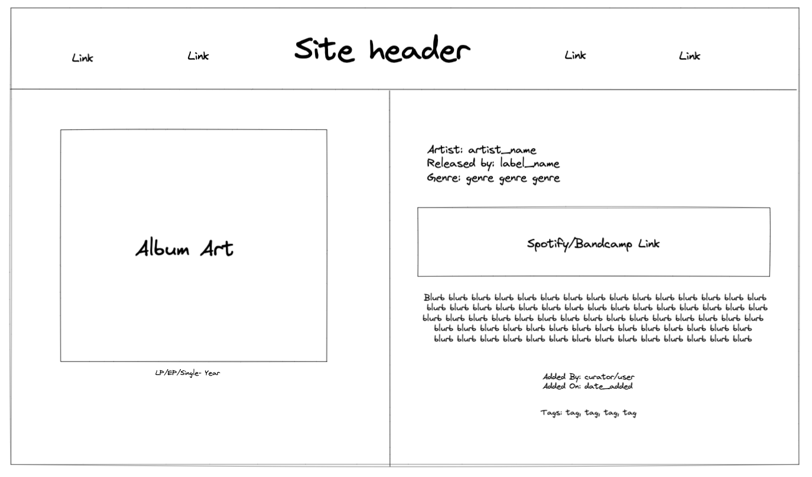

# point of no return
point of no return is a collaborative music library. Using Spotify's API and user submitted data, this site allows users to discover music using with genre, location, date, and release filtering.



## Technologies Used
- Django
- Django templates
- Python
- Django-Taggit
- Django Crispy Forms
- Django-Filter
- Postgres
- Bulma
- Spotify API

## User Stories
- To add music into database, user submits Spotify URI for desired artist
- User can provide remaining information about artist after artist is found in Spotify API
- Once artist is in database, user can add music to artist profile by submitting Spotify URI for album/song
- User can provide additional information about music after it is found in Spotify API
- User can customize search for music using filters on search page.
- User can view more info on artists, music, and tags

## Code Snippets
Spotify Calls
``` python
def music_add(request, uri):
    if request.method == 'POST':
        form = MusicSearchForm(request.POST)
        if form.is_valid():
            form_uri = form.cleaned_data['URI']
            search_type = form.cleaned_data['search_type']

            url = 'https://accounts.spotify.com/api/token'
            headers = {}
            data = {}

            message = f"{CLIENT_ID}:{CLIENT_SECRET}"
            messageBytes = message.encode('ascii')
            base64Bytes = base64.b64encode(messageBytes)
            base64Message = base64Bytes.decode('ascii')

            headers['Authorization'] = f'Basic {base64Message}'
            data['grant_type'] = 'client_credentials'

            r = requests.post(url, headers = headers, data=data)

            token = r.json()['access_token']
            pp = pprint.PrettyPrinter(indent=2)
            headers = {
                     "Authorization": "Bearer " + token,
               }

            print('form valid')


            if search_type == 'Album':
                album_url = f'https://api.spotify.com/v1/albums/{form_uri}?market=US'
                res = requests.get(url=album_url, headers=headers)
                album_json = json.dumps(res.json())
                album = json.loads(album_json)
                music = Music.objects.create(spotify_uri=form_uri, name=album['name'],album_art = album['images'][0]['url'], released_by = album['label'], release_date = album['release_date'], user = request.user, curator = Curator.objects.get(user=request.user))
                music.artist.add(Artist.objects.get(spotify_uri=uri))

 
                return redirect(f'/database/music/finish/{form_uri}')

            if search_type == 'Track':
                track_url = f'https://api.spotify.com/v1/tracks/{form_uri}?market=US'
                res = requests.get(url=track_url, headers=headers)
                track_json = json.dumps(res.json())
                track = json.loads(track_json)

                music = Music.objects.create(spotify_uri=form_uri, name=track['name'],album_art = track['images'][0]['url'], released_by = track['label'], release_date = track['release_date'], user = request.user, curator = Curator.objects.get(user=request.user))
                music.artist.add(Artist.objects.get(spotify_uri=uri))

                return redirect(f'/database/music/finish/{form_uri}')

```

Music Model
```python
class Music(models.Model):
    name = models.CharField(blank =True, max_length=100)
    release_date = models.DateField(blank =True)
    released_by = models.CharField(blank =True, max_length=1000)
    description = models.CharField(blank =True, max_length=1000)
    spotify_embed = models.CharField(blank =True, max_length=1000)
    bandcamp_embed = models.CharField(blank =True, max_length=1000)
    discogs_link = models.URLField(blank =True )
    genre = models.CharField(blank =True, max_length=1000)
    spotify_uri = models.CharField(blank = True, max_length=100)
    album_art = models.URLField(blank = True, max_length=1000)
    release_type = models.CharField(blank =True, max_length=10, choices = release_types)
    user = models.ForeignKey(User, on_delete=models.CASCADE)
    curator = models.ForeignKey(Curator, on_delete=models.CASCADE)
    artist = models.ManyToManyField(Artist, related_name = 'artists')
    comments = models.ForeignKey(Comment, null = True, blank=True, on_delete=models.CASCADE)
    tags = TaggableManager()
```

Music Filter
``` python
class MusicFilter(django_filters.FilterSet):
    description = CharFilter(field_name = 'description', label='Description',lookup_expr='icontains')
    artist = MultipleChoiceFilter(field_name='artist', choices = artist_list, label= 'artist')
    release_date = DateFromToRangeFilter(field_name = 'release_date')
    tags = MultipleChoiceFilter(field_name = 'tags', choices = tag_list)
    released_by = ChoiceFilter(field_name = 'released_by', choices = label_list)


    class Meta:
        model = Music
        fields = ['curator']
```


## Early Wireframing
Search Page


Music Page


## Future Considerations
- Goal of this was never to allow everyone to be able to add to database. Closing off add route to superuser-only and setting up a submission form for users to submit music for approval.
- Comments functionality
- Written content - blog portion of site
- Django Messages
- Flush out filtering system
- Page for different curators
- Custom slugs instead of Spotify URIs
- Spotify or bandcamp preference setting for users